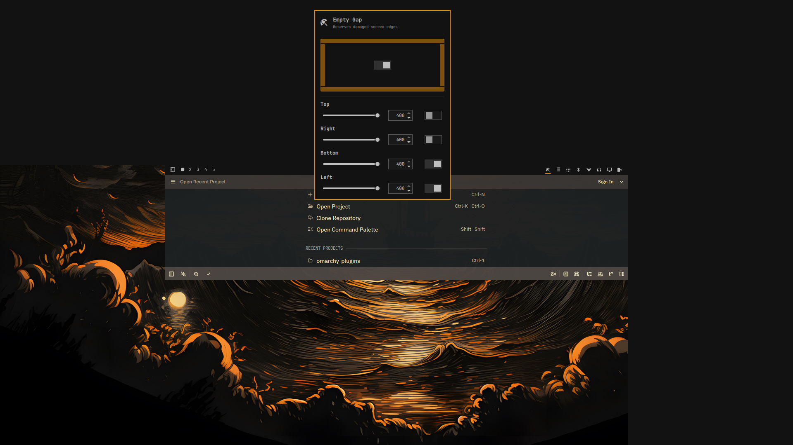

# Empty Gap

[](https://omarchy.org)
[]()

Requires **Omarchy 4.x** for inline settings. Older Omarchy releases are
supported via the legacy top-level config key (see below).

An [Omarchy](https://omarchy.org) shell plugin (Quickshell) that displays **empty strips** along one or more screen edges (up to all four) to reserve damaged monitor areas — e.g. the dark strip at the top of a laptop with a cracked screen.



## Features

- **All four edges**: reserve **Top / Right / Bottom / Left** simultaneously — each edge has its own height and transparency.
- **Screen cube picker**: click the sides of the preview cube in the panel to toggle each edge; a master switch in the middle turns the whole plugin on/off.
- **Any height**: 0–400 px per edge, via a slider or exact numeric input.
- **Transparent**: per edge — use the bar theme color or go fully transparent.
- **Original bar stays visible**: if the Omarchy bar sits on the same edge as the strip, the bar is pushed inward (to the inner side of the strip) instead of being covered by it.
- **Independent**: the strip does not follow `omarchy toggle bar` or the original bar's transparency toggle.
- **Live reload**: every change is saved to `shell.json` and applied immediately.

## Installation

```bash
omarchy plugin add https://github.com/syaifulmain/omarchy-empty-gap.git --enable
```

During the interactive install, pick the bar section for the button (default: *right*).

Once installed, the 󱢊 icon button appears on the bar. Click it to open the settings panel.

## Update

Pull the latest version from the repository:

```bash
omarchy plugin update syaifulmain.emptygap --yes
```

Then reload the shell so the new code takes effect (e.g. log out and back
in, or restart the shell).

## Remove

```bash
omarchy plugin remove syaifulmain.emptygap --yes
```

This deletes the plugin from `~/.config/omarchy/plugins/` and removes its
entry from the bar layout. Any strips currently on screen disappear after
the shell reloads.

## Usage

The **Empty Gap** button panel contains:

| Control | Function |
| --- | --- |
| Screen cube | Click a side to enable/disable that edge (filled = active) |
| Center switch | Master on/off for all strips |
| Per-edge row: slider | Strip height for that edge (0–200) |
| Per-edge row: input | Exact height (0–400 px; 0 = no space reserved) |
| Per-edge row: switch | Transparent strip or theme background |

All values are stored inline on the widget entry in `~/.config/omarchy/shell.json`:

```json
"bar": {
  "layout": {
    "right": [
      {
        "id": "syaifulmain.emptygap",
        "enabled": true,
        "edges": {
          "top":    { "enabled": true,  "height": 26,  "transparent": true  },
          "right":  { "enabled": false, "height": 40,  "transparent": false },
          "bottom": { "enabled": false, "height": 40,  "transparent": false },
          "left":   { "enabled": false, "height": 40,  "transparent": false }
        }
      }
    ]
  }
}
```

## Compatibility

Works on both Omarchy 4.x and older releases:

- **Omarchy 4.x**: settings are stored inline on the widget entry in
  `bar.layout` (see the example above) and are written through
  `shell.updateEntryInline`.
- **Older Omarchy**: settings live under a top-level `syaifulmain.emptygap`
  key in shell.json and are written through `shell.mutateShellConfig`; the
  strips are rendered by the `service` entry point (`Shim.qml`), which is
  inert on 4.x.
- **Upgrading Omarchy from an old release with this plugin installed**: the
  legacy top-level key is no longer readable on 4.x, so strips stay off until
  you open the Empty Gap panel once and toggle an edge — the settings are
  then written inline on the widget entry and persist from there.

Legacy single-edge configs (`"edge"`, `"height"`, `"transparent"`) are
migrated automatically on read.

## How it works

The strip is a layer-shell `PanelWindow` on `WlrLayer.Bottom` with the namespace
`syaifulmain-emptygap`. Because the compositor processes the bottom layer first, the
strip claims the outermost screen edge (exclusive zone) and the Omarchy bar on
the same edge is automatically pushed inward — to the inner side of the strip.

## Verify installation

```bash
omarchy plugin list            # syaifulmain.emptygap should appear
hyprctl layers | grep emptygap # strip is active
```

## Structure

```text
manifest.json   # plugin metadata (id: syaifulmain.emptygap, kinds: service + bar-widget)
Shim.qml        # service (pre-4.x hosts): one PanelWindow strip per enabled edge
Panel.qml       # bar-widget: button + settings panel + strips (4.x) / dual-host config
```

## Changelog

See [CHANGELOG.md](CHANGELOG.md).

## License

[MIT](LICENSE)
